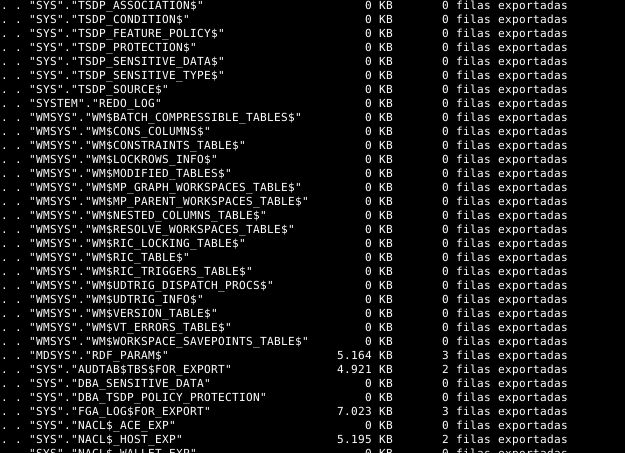
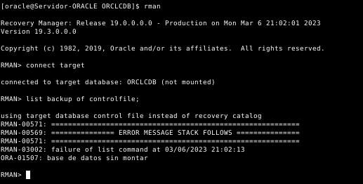

# **ABD**
## **Copias de Seguridad y Restauración**
#### Realizado por: **Iván Piña Castillo**

-----------------------------------------------------------------------------------------------------------------------------------

## 1. Realiza una copia de seguridad lógica de tu base de datos completa, teniendo en cuenta los siguientes requisitos:

▪ La copia debe estar encriptada y comprimida.

▪ Debe realizarse en un conjunto de ficheros con un tamaño máximo de 60 MB.

▪ Programa la operación para que se repita cada día a una hora determinada.

Para realizar una copia de seguridad lógica de una base de datos ORACLE completa con los requisitos indicados, lo primero que tendremos que tener en cuenta son los permisos que tenemos sobre la base de datos. El usuario SYS y el usuario SYSTEM tienen permisos suficientes para realizar la copia de seguridad. También podemos crear un usuario con el rol DBA para realizar la copia de seguridad.

En mi caso crearé un usuario llamado "BACKUP" con el rol DBA para realizar la copia de seguridad. Esto lo realizaré como SYSDBA, para ello, ejecutaremos el siguiente comando en la línea de comandos:
```sql
alter session set "_ORACLE_SCRIPT"=true;
CREATE USER BACKUP IDENTIFIED BY BACKUP;
GRANT CONNECT, RESOURCE, DBA TO BACKUP;
ALTER USER BACKUP ACCOUNT UNLOCK;
```


Hecho esto, crearemos un directorio en el sistema de archivos de Linux donde se almacenará la copia de seguridad.
```bash
mkdir /home/oracle/backups
```


Luego, nos dirigiremos a SQL*Plus y ejecutaremos el siguiente comando para crear el directorio en la base de datos como SYSDBA de nuevo:
```sql
CREATE DIRECTORY backups AS '/home/oracle/backups';
```


Es importante que le demos al usuario los permisos necesarios para poder leer y escribir en el directorio creado:
```sql
GRANT READ,WRITE ON DIRECTORY BACKUPS TO BACKUP;
```


Crearemos un script de copia de seguridad que contenga los comandos necesarios para realizar la copia de seguridad:
```bash
nano /home/oracle/backup.sh

#!/bin/bash

# Definimos variables
FECHA=`date +%Y%m%d%H%M%S`
USUARIO=BACKUP
PASSWORD=BACKUP
RUTA_BACKUP=/home/oracle/backups
DIRECTORY=backups
NOMBRE_BACKUP=backup_$FECHA
FICHERO_BACKUP=$RUTA_BACKUP/$NOMBRE_BACKUP

# Realizamos la copia de seguridad
expdp $USUARIO/$PASSWORD directory=$DIRECTORY dumpfile=$NOMBRE_BACKUP.dmp logfile=$NOMBRE_BACKUP.log encryption_password=$PASSWORD compression=ALL full=y filesize=60M
```

Deberemos dar permisos de ejecución al script:
```bash
chmod +x /home/oracle/backup.sh
```

Las opciones que he utilizado en el script son las siguientes:

**COMPRESSION=ALL**: comprime la copia de seguridad.

**FULL=Y**: realiza una copia de seguridad completa de la base de datos.

**FILESIZE=60M**: divide la copia de seguridad en ficheros de 60MB.

**DUMPFILE**: indica el nombre del fichero de copia de seguridad.

**LOGFILE**: indica el nombre del fichero de log.

**ENCRYPTION_PASSWORD**: indica la contraseña para encriptar la copia de seguridad.

Primero ejecutaré el script a mano para asegurar que funciona correctamente:
```bash
. backup.sh
```


-


-



-


-


Vamos a mirar el fichero de log para comprobar que la copia de seguridad se ha realizado correctamente (la información que aparece en el fichero de log es la misma que aparece en la terminal):


Ahora programaremos la ejecución del script de copia de seguridad a una hora determinada (10 de la mañana) cada día. Para ello, usaré cron. 
```bash
export EDITOR=nano
crontab -e
```
```javascript
0 10 * * * /home/oracle/backup.sh
```

Con estos pasos, se realizará una copia de seguridad lógica de la base de datos ORACLE completa encriptada y comprimida, dividida en ficheros de 60MB y programada para que se ejecute automáticamente cada día a las 10 de la mañana.

El único problema que tendría es que mi base de datos es muy pequeña y no tiene mucho contenido, por lo que la copia de seguridad no sería muy grande.

## 2. Restaura la copia de seguridad lógica creada en el punto anterior.

Para restaurar la copia de seguridad lógica creada en el punto anterior, primero eliminaré las tablas del usuario SCOTT y del usuario FINCA, esto lo realizaré como SYSDBA:
```sql
alter session set "_ORACLE_SCRIPT"=true;
CONNECT SCOTT/TIGER;
SELECT TABLE_NAME FROM ALL_TABLES WHERE OWNER = 'SCOTT';
DROP TABLE EMP;
DROP TABLE DEPT;
DROP TABLE SALGRADE;
DROP TABLE BONUS;
DROP TABLE DUMMY;
```


Vamos a comprobar que las tablas del usuario SCOTT han sido eliminadas correctamente:
```sql
SELECT TABLE_NAME FROM ALL_TABLES WHERE OWNER = 'SCOTT';
```


```sql
CONNECT FINCA/FINCA;
SELECT TABLE_NAME FROM ALL_TABLES WHERE OWNER = 'FINCA';
BEGIN
  FOR i IN (SELECT TABLE_NAME FROM ALL_TABLES WHERE OWNER = 'FINCA') LOOP
    EXECUTE IMMEDIATE 'DROP TABLE ' || i.TABLE_NAME || ' CASCADE CONSTRAINTS';
  END LOOP;
END;
/
```


Vamos a comprobar que las tablas del usuario FINCA han sido eliminadas correctamente:
```sql
SELECT TABLE_NAME FROM ALL_TABLES WHERE OWNER = 'FINCA';
```


Bien, ahora vamos a restaurar la copia de seguridad. Para ello, ejecutaremos el siguiente comando en la línea de comandos:
```bash
impdp BACKUP/BACKUP directory=backups dumpfile=backup_20230306184045.dmp encryption_password=BACKUP full=y logfile=restore_20230306184045.log
```


Veremos que aquellos objetos que ya existían en la base de datos no se han restaurado, ya que no se han eliminado antes de restaurar la copia de seguridad.


Aquí vemos como restaura las tablas eliminadas:


Podemos mirar el archivo de log para comprobar que la restauración se ha realizado correctamente (la información que aparece en el fichero de log es la misma que aparece en la terminal):


Ahora vamos a comprobar que las tablas se han restaurado correctamente:
```sql
SELECT TABLE_NAME FROM ALL_TABLES WHERE OWNER = 'SCOTT';
```


```sql
SELECT TABLE_NAME FROM ALL_TABLES WHERE OWNER = 'FINCA';
```


Como podemos apreciar, nuestra base de datos ha sido restaurada correctamente.

## 3. Pon tu base de datos en modo ArchiveLog y realiza con RMAN una copia de seguridad física en caliente.

Para poner la base de datos en modo ArchiveLog conectaremos a la base de datos como SYSDBA y ejecutaremos lo siguiente:
```sql
shutdown immediate;
startup mount;
alter database archivelog;
alter database open;
```


Estos comandos detendrán la base de datos, la pondrán en modo de montaje, la cambiarán a modo ArchiveLog y la volverán a abrir.

Ahora vamos a comprobar que la base de datos está en modo ArchiveLog:
```sql
SELECT log_mode FROM V$DATABASE;
```


Deberemos como SYSDBA (como ya hicimos antes) crear un usuario con los privilegios adecuados para la copia de seguridad:
```sql
alter session set "_ORACLE_SCRIPT"=true;
CREATE USER RMAN IDENTIFIED BY RMAN;
GRANT CONNECT, RESOURCE TO RMAN;
GRANT RECOVERY_CATALOG_OWNER TO RMAN;
```


También deberemos crear un tablespace para el usuario RMAN:
```sql
CREATE TABLESPACE TS_RMAN_DATA DATAFILE '/opt/oracle/oradata/ORCLCDB/ts_rman_data.dbf' SIZE 500M AUTOEXTEND ON NEXT 10M MAXSIZE UNLIMITED;
ALTER USER RMAN DEFAULT TABLESPACE TS_RMAN_DATA QUOTA UNLIMITED ON TS_RMAN_DATA;
```


Para configurar RMAN para la copia de seguridad lo iniciaremos con el siguiente comando desde la terminal bash:
```bash
rman
```


Este comando abrirá la herramienta RMAN.

Acto seguido, nos conectaremos a la base de datos mediante RMAN:
```css
connect CATALOG RMAN/RMAN;
```


Ahora vamos a tener que crear el catálogo a partir del tablespace que hemos creado anteriormente:
```css
CREATE CATALOG TABLESPACE TS_RMAN_DATA;
```


Ya podremos conectarno al catálogo de RMAN, para ello ejecutaremos el siguiente comando desde la terminal bash:
```bash
rman target =/ catalog RMAN/RMAN
```


Acto seguido, registraremos nuestra base de datos en el catálogo de RMAN:
```css
REGISTER DATABASE;
```


Realizaremos la copia de seguridad en caliente mediante RMAN. Podemos hacerlo mediante el siguiente comando en RMAN:
```css
BACKUP DATABASE PLUS ARCHIVELOG;
```


-


Este comando realizará una copia de seguridad completa de la base de datos, incluyendo los archivos de registro de ArchiveLog.

Para verificar que la copia de seguridad se ha realizado correctamente. Podemos hacerlo mediante el siguiente comando en RMAN:
```css
RESTORE DATABASE PREVIEW;
```


-


Este comando mostrará una vista previa de la restauración de la base de datos a partir de la copia de seguridad.

Con estos pasos, hemos puesto la base de datos en modo ArchiveLog y realizado una copia de seguridad física en caliente mediante RMAN.

## 4. Borra un fichero de datos de un tablespace e intenta recuperar la instancia de la base de datos a partir de la copia de seguridad creada en el punto anterior.

Primero vamos a eliminar un fichero de datos de un tablespace. Para ello, conectaremos a la base de datos como SYSDBA y haremos una consulta para ver los tablespaces existentes y otra para ver los ficheros de datos de cada tablespace:
```sql
SELECT TABLESPACE_NAME FROM DBA_TABLESPACES;
SELECT FILE_NAME FROM DBA_DATA_FILES;
```


Me he decantado por eliminar el fichero del tablespace USERS (intenté hacerlo del SYSTEM pero me dio bastantes fallos a la hora de restaurar), aunque antes de eliminarlo lo copiaré y guardaré en otro sitio por si no soy capaz de restaurar la base de datos.


Ahora vamos a comprobar que el fichero de datos ha sido eliminado correctamente, para ello ejecutaré diversas consulta:
```sql
select * from FINCA.administradores;
select * from SCOTT.dept;
select * from FASE2.propietarios;
```


Como podemos apreciar, el fichero de datos ha sido eliminado correctamente y no podemos acceder a los datos de la base de datos.

Tras esto, nos conectaremos a RMAN y restauraremos la base de datos a partir de la copia de seguridad:
```bash
rman target =/ catalog RMAN/RMAN
```

Para comprobar si el fichero de datos eliminado está incluido en la copia de seguridad. Para ello, podemos ejecutar el siguiente comando en RMAN:
```sql
list backup of datafile '/opt/oracle/oradata/ORCLCDB/users01.dbf';
```


Este comando nos mostrará si el fichero de datos eliminado está incluido en la copia de seguridad y en qué copia de seguridad se encuentra.

Para restaurar el fichero de datos eliminado desde la copia de seguridad, primero deberemos desactivar el tablespace USERS:
```sql
SQL "ALTER TABLESPACE USERS OFFLINE IMMEDIATE";
```


Tras esto, ya podremos restaurar el fichero de datos eliminado desde la copia de seguridad:
```SQL
RESTORE TABLESPACE USERS;
```


```sql
RECOVER TABLESPACE USERS;
```


Este comando restaurará el fichero de datos eliminado desde la copia de seguridad a su ubicación original.

Volveremos a activar el tablespace USERS:
```sql
SQL "ALTER TABLESPACE USERS ONLINE";
```


Vamos a comprobar que la base de datos se ha recuperado correctamente:
```sql
select * from FINCA.administradores;
select * from SCOTT.dept;
select * from FASE2.propietarios;
```


Como podemos apreciar, la base de datos se ha recuperado correctamente.
```bash
ls -lha /opt/oracle/oradata/ORCLCDB
```


## 5. Borra un fichero de control e intenta recuperar la base de datos a partir de la copia de seguridad creada en el punto anterior.

Primero vamos a eliminar un fichero de control. 


Tras esto, conectaremos a la base de datos como SYSDBA y ejecutaremos lo siguiente:
```sql
shutdown abort;
startup nomount;
```


Estos comandos forzarán la detención de la base de datos y la pondrán en modo de no montaje.

Tras esto, nos conectaremos a RMAN y restauraremos la base de datos a partir de la copia de seguridad:
```bash
rman
```
```sql
connect target
```

Para comprobar si el fichero de control eliminado está incluido en la copia de seguridad. Para ello, podemos ejecutar el siguiente comando en RMAN:
```sql
list backup of controlfile;
```



Este comando nos mostrará si el fichero de control eliminado está incluido en la copia de seguridad y en qué copia de seguridad se encuentra.

Sin embargo, como no tenemos la base de datos montada, no podemos acceder al catalogo de RMAN (que creamos anteriormente a partir de la base de datos), por lo que deberemos hacerlo a mano.

Primero deberemos averiguar la ubicación de la copia de seguridad de RMAN:
```bash
find / -name "c-2890114408-20230306-01"
```


```sql
restore controlfile from '/opt/oracle/product/19c/dbhome_1/dbs/c-2890114408-20230306-01';
```


Este comando restaurará el fichero de control eliminado desde la copia de seguridad a su ubicación original.

¿Cómo se que ahí se encontraba el fichero de control? Pues porque cuando creamos la copia de seguridad, RMAN nos lo indicó:


Para recuperar la base de datos, la volveremos a montar, haremos un recover y la abriremos reseteando los logs:
```go
alter database mount;
alter database open resetlogs;
recover database;
```


-


-


Ya tendríamos recuperada la base de datos utilizando los archivos restaurados y los archivos de registro de ArchiveLog.

## 6. Documenta el empleo de las herramientas de copia de seguridad y restauración de Postgres.

En Postgres, para realizar una copia de seguridad de la base de datos, podemos hacerlo usando la herramienta pg_dumpall. Para ello, ejecutaremos el siguiente comando:
```bash
pg_dumpall -U postgres -f backups/backup.sql
```


Este comando creará un fichero llamado backup.sql en el directorio /backups con el contenido de la base de datos.

Vamos a comprobar que el fichero se ha creado correctamente:
```bash
ls -lha backups/backup.sql
```


Si miramos el contenido del fichero, veremos que contiene las sentencias SQL necesarias para crear la base de datos y los datos de la base de datos:
```bash
nano backups/backup.sql
```


Para comprobar que la restauración de la base de datos funciona correctamente, vamos a eliminar el usuario scott y la base de datos scott:
```sql
drop database scott;
drop database scott2;
drop database scott3;
drop owned by scott;
drop user scott;
```


-


-


Vamos a comprobar que el usuario y la base de datos han sido eliminados correctamente:
```sql
select * from pg_user where usename = 'scott';
\c scott
\c scott2
\c scott3
```


Vamos a ver que base de datos tenemos actualmente:
```sql
select * from pg_database;
```


Y también los usuarios:
```sql
select * from pg_user;
```


Bien, efectivamente como podemos ver ya no queda rasgo alguno de la base de datos scott y el usuario scott.

Ahora vamos a restaurar la base de datos a partir de la copia de seguridad:
```bash
psql -U postgres -f backups/backup.sql
```

Este comando restaurará la base de datos a partir del fichero backup.sql.


-


Veremos que al realizar la restauración, aquellos datos ya existentes en la base de datos se mantendrán y los datos que no existían se crearán.

Vamos a comprobar que la base de datos se ha restaurado correctamente:
```sql
select * from pg_user;
```


Como podemos apreciar, el usuario scott ha sido restaurado correctamente.

Vamos a comprobar que la base de datos se ha restaurado correctamente:
```sql
select * from pg_database;
```


Como podemos apreciar, la base de datos scott ha sido restaurada correctamente.

Vamos a comprobar que las tablas se han restaurado correctamente:
```sql
\c scott
\dt
select * from emp;
```


Si queremos que la copia de seguridad se realice automáticamente cada cierto tiempo (por ejemplo todos los dias a las 10 de la mañana), podemos usar la herramienta cron. Para ello, ejecutaremos el siguiente comando:
```bash
crontab -e
```
```bash
0 10 * * * pg_dumpall -U postgres -f /home/postgres/backups/backup-$(date +%Y-%m-%d).sql
```

## 7. Documenta el empleo de las herramientas de copia de seguridad y restauración de MySQL.

En MySQL, para realizar una copia de seguridad de la base de datos, podemos hacerlo usando la herramienta mysqldump. Para ello, ejecutaremos el siguiente comando:
```bash
mysqldump -u root -p --all-databases > backups/backup.sql
```


Este comando creará un fichero llamado backup.sql en el directorio /backups con el contenido de la base de datos.

Vamos a comprobar que el fichero se ha creado correctamente:
```bash
ls -lha backups/backup.sql
```


Si miramos el contenido del fichero, veremos que contiene las sentencias SQL necesarias para crear la base de datos y los datos de la base de datos:
```bash
nano backups/backup.sql
```


Para comprobar que la restauración de la base de datos funciona correctamente, vamos a eliminar el usuario scott y la base de datos scott:
```sql
drop user scott;
drop database scott;
```


Vamos a comprobar que el usuario y la base de datos han sido eliminados correctamente:
```sql
use scott;
SYSTEM mysql -u scott -p;
show databases;
select user, host from mysql.user;
```


-


Ahora vamos a restaurar la base de datos a partir de la copia de seguridad:
```bash
mysql -u root -p < backups/backup.sql
```


Este comando restaurará la base de datos a partir del fichero backup.sql.

Vamos a comprobar que la base de datos se ha restaurado correctamente:
```sql
show databases;
select user, host from mysql.user;
```


```sql
use scott;
show tables;
select * from EMP;
```


Como podemos apreciar, la base de datos se ha restaurado correctamente.

Si queremos que la copia de seguridad se realice automáticamente cada cierto tiempo (por ejemplo todos los dias a las 10 de la mañana), podemos usar la herramienta cron. Para ello, ejecutaremos el siguiente comando:
```bash
crontab -e
```
```bash
0 10 * * * mysqldump -u root -p --all-databases > /home/root/backups/backup-$(date +%Y-%m-%d).sql
```

## 8. Documenta el empleo de las herramientas de copia de seguridad y restauración de MongoDB.

En MongoDB, para realizar una copia de seguridad de la base de datos, podemos hacerlo usando la herramienta mongodump. Para ello, ejecutaremos el siguiente comando:
```bash
mongodump -u admin --db Practica --authenticationDatabase admin --out backups
```


Este comando creará un directorio llamado Practica que contendrá el backup de las colecciones de la base de datos Practica.

Vamos a comprobar que el fichero se ha creado correctamente:
```bash
ls -lha backups/Practica
```


Si miramos el contenido del fichero, veremos que contiene las sentencias JSON necesarias para crear la base de datos y los datos de la base de datos:
```bash
bsondump backups/Practica/prueba1.bson | jq
```


```bash
cat backups/Practica/prueba1.metadata.json | jq
```


Para comprobar que la restauración de la base de datos funciona correctamente, vamos a eliminar la base de datos Practica y sus colecciones:
```java
show dbs;
use Practica;
show collections;
db.prueba1.drop();
db.dropDatabase();
```


-


Vamos a comprobar que la base de datos ha sido eliminada correctamente:
```java
show dbs;
```


Ahora vamos a restaurar la base de datos a partir de la copia de seguridad:
```bash
mongorestore -u admin --db Practica --authenticationDatabase admin backups/Practica
```


Este comando restaurará la base de datos a partir del fichero backup.json.

Vamos a comprobar que la base de datos se ha restaurado correctamente:
```java
show dbs;
use Practica;
show collections;
db.prueba1.find();
```


Como podemos apreciar, la base de datos se ha restaurado correctamente.

Si queremos que la copia de seguridad se realice automáticamente cada cierto tiempo (por ejemplo todos los dias a las 10 de la mañana), podemos usar la herramienta cron. Para ello, ejecutaremos el siguiente comando:
```bash
crontab -e
```
```bash
0 10 * * * mongodump -u admin --db Practica --authenticationDatabase admin --out /home/root/backups/backup-$(date +%Y-%m-%d)
```
